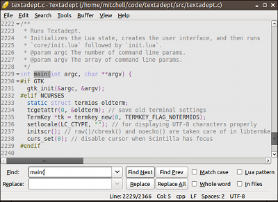

# User Interface

Textadept's user interface is sleek and simple. It consists of a menu (GUI
version only), editor view, and statusbar. There is also a find & replace pane
and a command entry, but Textadept initially hides them both. The manual briefly
describes these features below, but provides more details later.

## Menu

The completely customizable menu provides access to all of Textadept's features.
Only the GUI version implements it, though. The terminal version furnishes the
[command selection][] dialog instead. Textadept is very keyboard-driven and
assigns key shortcuts to most menu items. Your [key preferences][] can change
these shortcuts and reflect in the menu. Here is a [complete list][] of default
key bindings.

[command selection]: 10_Advanced.html#Command.Selection
[key preferences]: 08_Preferences.html#Key.Bindings
[complete list]: api/_M.textadept.keys.html#Key.Bindings

## Editor View

Most of your time spent with Textadept is in the editor view. The GUI version
features unlimited view splitting both vertically and horizontally. Lua also has
complete control over all views.

## Find & Replace Pane

This compact pane is a great way to slice and dice through your document or a
directory of files. It even supports finding and replacing text using Lua
patterns and Lua code. The pane is available only when you need it and quickly
gets out of your way when you do not, minimizing distractions.

## Command Entry

The versatile command entry functions as, among other things, a place to execute
Lua commands with Textadept's internal Lua state, find text incrementally, and
execute shell commands. Lua extensions allow it to do even more. Like the Find &
Replace pane, the command entry pops in and out as you wish.

## Statusbar

The statusbar actually consists of two statusbars. The one on the left-hand
side displays temporary status messages while the one on the right-hand side
persistently shows the current buffer status.
