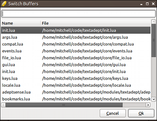
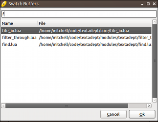
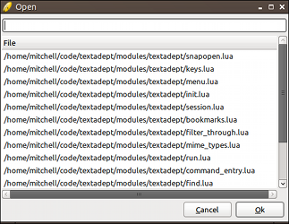

# Working with Files

## Buffers

One of the first things you will notice when opening multiple files in Textadept
is that there is no tab bar showing the files that are open. This was a design
decision because Textadept was built to support unlimited split views. Having a
single tab bar for multiple views would cause confusion and having one tab bar
per view would clutter the interface.

Instead of having tabs, Textadept has the buffer browser. Press `Ctrl+B` (`⌘B`
on Mac OSX | `M-B` or `M-S-B` in ncurses) to open it.

The buffer browser shows you a list of currently open buffers, the most recent
towards the bottom. Typing part of any filename filters the list. Spaces are
wildcards. You can also just use the arrow keys. Pressing `Enter` or selecting
`OK` switches to the selected buffer.

You can see which buffer is active by looking at Textadept's titlebar. Pressing
`Ctrl+Tab` (`^⇥` on Mac OSX | `M-N` in ncurses) cycles to the next buffer and
`Ctrl+Shift+Tab` (`^⇧⇥` | `M-P`) cycles to the previous one.

### Settings

Individual files have three configurable settings: indentation, line endings,
and encoding. Indentation is composed of an indentation character and an
indentation size. Line endings are characters that separate lines. File
encoding determines how text characters are displayed. Textadept shows these
settings in the buffer status statusbar.

#### Indentation

Indentation is usually set by a [language-specific module][] or the current
[theme][]. By default, indentation is 2 spaces. You can toggle between using
tabs and spaces manually by pressing `Ctrl+Alt+Shift+T` (`^⇧T` on Mac OSX |
`M-T` or `M-S-T` in ncurses). Toggling between tabs and spaces only affects
future indentation; it does not convert existing indentation. `Ctrl+Alt+I` (`^I`
| `M-I`) performs the conversion. (If the buffer is using tabs, all indenting
spaces are converted to tabs. If the buffer is using spaces, all indenting tabs
are converted to spaces.) Similarly, you can set indentation size manually using
the "Buffer -> Indentation" menu.

[language-specific module]: 07_Modules.html#Buffer.Properties
[theme]: 09_Themes.html#Buffer

#### Line Endings

Line endings, commonly known as end-of-line (EOL) markers, are set for new files
based on the current platform. On Windows, CRLF ("\r\n") is used. Otherwise, LF
("\n") is. This can be changed manually using the "Buffer -> EOL Mode" menu.
Unlike indentation settings, switching EOL modes converts all existing EOLs
automatically. Textadept attempts to auto-detect the EOL mode of opened files
regardless of the current platform, but falls back to the defaults mentioned
earlier when necessary.

#### Encodings

Textadept represents all characters and strings internally as UTF-8. You will
not notice any difference for working with files containing ASCII text since
UTF-8 is compatible with it. Textadept can also detect ISO-8859-1 and MacRoman,
the primary encodings used on Windows and Mac OSX respectively. Files with more
exotic encodings may not be detected properly, if at all. You can change the
list of encodings Textadept tries to detect via [`io.try_encodings`][].

It is recommended to use UTF-8 encoded files because UTF-8 is very well
supported by other text editors and operating systems. You can change file
encoding via the "Buffer -> Encoding" menu. Conversion is immediate, requiring
no separate steps. Textadept saves new files as UTF-8 by default, but does not
alter the encoding of existing files.

[`io.try_encodings`]: api/io.html#try_encodings

### Recent Files

Pressing `Ctrl+Alt+O` (`^⌘O` on Mac OSX | `M-^O` in ncurses) brings up a dialog
that behaves like the buffer browser, but displays a list of recently opened
files to reopen.

### Sessions

By default, Textadept saves its state on exit so it can be restored the next
time the editor starts up. You can disable this by passing the `-n` or
`--nosession` switch to Textadept on startup. Sessions can be manually saved and
opened via the "File -> Save Session..." and "File -> Load Session..." menus.
Session files store information such as open buffers, current split views, caret
and scroll positions in each buffer, Textadept's window size, and recently
opened files. Tampering with session files may have unintended consequences.

### Snapopen

A quicker, though slightly more limited alternative to the standard file
selection dialog is snapopen. It behaves like the buffer browser, but displays a
list of files to open, including files in sub-directories. You can snapopen the
current file's directory with `Ctrl+Alt+Shift+O` (`^⌘⇧O` on Mac OSX | `M-S-O` in
ncurses) or from the "Tools -> Snapopen -> Current Directory" menu. Snapopen is
pretty limited from the menu, but more versatile in [scripts][]. `Ctrl+U` (`⌘U`
| `^U`) snaps open *~/.textadept/*.

[scripts]: api/_M.textadept.snapopen.html

## Views

### Split Views

Textadept allows you to split the editor window as many times as you like both
horizontally and vertically. `Ctrl+Alt+S` or `Ctrl+Alt+H` splits horizontally
into top and bottom views and `Ctrl+Alt+V` splits vertically (`^S` and `^V`
respectively on Mac OSX | N/A in ncurses) into side-by-side views. You can
resize the splitter bar by clicking and dragging with the mouse or using
`Ctrl+Alt++` and `Ctrl+Alt+-` (`^+` and `^-` | N/A). The same file can be opened
in multiple views.

Pressing `Ctrl+Alt+N` (`^⌥⇥` on Mac OSX | N/A in ncurses) goes to the next view
and `Ctrl+Alt+P` (`^⌥⇧⇥` | N/A) goes to the previous one. Note: depending on the
split sequence, the order when cycling between views may be unexpected.

To unsplit a view, enter the view to keep open and press `Ctrl+Alt+W` (`^W` on
Mac OSX | N/A in ncurses). To unsplit all views, use `Ctrl+Alt+Shift+W` (`^⇧W` |
N/A).

Split views are unavailable in ncurses.

### Settings

Individual views have many configurable settings. Among the more useful settings
are viewing line endings, handling long lines, viewing indentation guides, and
viewing whitespace. These options change how buffers in the _current_ view are
displayed. Changing a setting in one view does not change that setting in
any other split view. It will have to be done manually.

#### Line Endings

Normally, EOL characters ("\r" and "\n") are invisible. Pressing
`Ctrl+Alt+Enter` (`^↩` on Mac OSX | none in ncurses) toggles their visibility.

#### Long Lines

By default, lines with more characters than the view can show are not wrapped
into view. `Ctrl+Alt+\` (`^\` on Mac OSX | none in ncurses) toggles line
wrapping.

#### Indentation Guides

By default, small guiding lines are shown based on indentation level.
`Ctrl+Alt+Shift+I` (`^⇧I` on Mac OSX | N/A in ncurses) toggles showing these
guides.

Indentation guides are unavailable in ncurses.

#### Whitespace

Normally, whitespace characters, tabs and spaces, are invisible. Pressing
`Ctrl+Alt+Shift+S` (`^⇧S` on Mac OSX | none in ncurses) toggles their
visibility. Visible spaces are shown as dots and visible tabs are shown as
arrows.

### Zoom

You can temporarily increase or decrease the font size in a view with `Ctrl+=`
(`⌘=` on Mac OSX | N/A in ncurses) and `Ctrl+-` (`⌘-` | N/A) respectively.
`Ctrl+0` (`⌘0` | N/A) resets the zoom.

Zooming is unavailable in ncurses.
