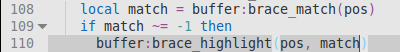

# File Navigation

## Basic Movements

Textadept implements the customary key bindings for navigating text fields on
the current platform. The arrow keys move the caret in a particular direction,
`Ctrl+Left` and `Ctrl+Right` (`^⇠` and `^⇢` on Mac OSX | `^Left` and `^Right` in
curses) move by words, `PgUp` and `PgDn` (`⇞` and `⇟` | `PgUp` and `PgDn`) move
by pages, etc. Mac OSX and curses also handle some Bash-style bindings like
`^B`, `^F`, `^P`, `^N`, `^A`, and `^E`. The "Movement" section of the
[key bindings list][] lists all movement bindings.

[key bindings list]: api/_M.textadept.keys.html#Key.Bindings

## Brace Match

By default, Textadept highlights the matching brace characters under the caret:
'(', ')', '[', ']', '{', and '}'. Pressing `Ctrl+M` (`^M` on Mac OSX | `M-M` in
curses) moves the caret to the matching brace.

## Bookmarks

Textadept supports bookmarking buffer lines to jump back to them later.
`Ctrl+F2` (`⌘F2` on Mac OSX | `F1` in curses) toggles a bookmark on the current
line, `F2` jumps to the next bookmarked line, `Shift+F2` (`⇧F2` | `F3`) jumps to
the previously bookmarked line, `Alt+F2` (`⌥F2` | `F4`) jumps to the bookmark
selected from a list, and `Ctrl+Shift+F2` (`⌘⇧F2` | `F6`) clears all bookmarks
in the current buffer.

## Goto Line

To jump to a specific line in a file, press `Ctrl+J` (`⌘J` on Mac OSX | `^J` in
curses), specify the line number in the prompt, and press `Enter` (`↩` |
`Enter`) or click `Ok`.
