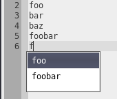
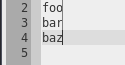
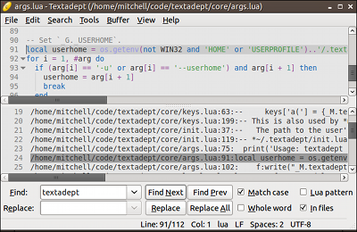
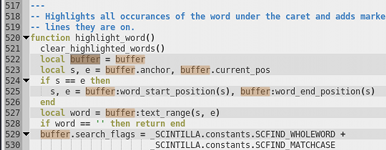
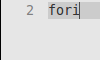
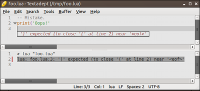

# Adept Editing

## Basic Editing

Textadept features many common, basic editing features: inserting text,
undo/redo, manipulating the clipboard, deleting characters and words,
duplicating lines, joining lines, and transposing characters. The top-level
"Edit" menu contains these actions and lists their associated key bindings. The
manual discusses more elaborate editing features below.

### Autopaired Characters

Usually, brace ('(', '[', '{') and quote ('&apos;', '&quot;') characters go
together in pairs. Textadept automatically inserts the complement character of
any user-typed opening brace or quote character and allows the user to
subsequently type over it. Similarly, the editor deletes the complement when
you press `Bksp` (`⌫` on Mac OSX | `Bksp` in curses) over the typed one. The
[preferences][] page details how to configure or disable these features.

[preferences]: 08_Preferences.html#Generic

### Word Completion

Textadept provides buffer-based word completion. Start typing a word and press
`Ctrl+Enter` (`^⎋` on Mac OSX | `M-Enter` in curses) to display a list of
suggested completions based on words in the current buffer. Continuing to type
changes the suggestion. Press `Enter` (`↩` | `Enter`) to complete the selected
word.

### Virtual Space Mode

Pressing `Ctrl+Alt+Shift+V` (`^⇧V` in Mac OSX | none in curses) enables and
disables Virtual space (freehand) mode. When virtual space is enabled, the caret
may move into the space past the ends of lines.

### Overwrite Mode

Enable and disable overwrite mode with the `Insert` key. When enabled, typing
overwrites existing characters in the buffer rather than inserting the typed
characters. The caret also changes to an underline in overwrite mode.

## Selections

Textadept includes many ways of creating and working with selections. Creating
basic selections entails holding down the "Shift" modifier key and then pressing
the arrow keys, clicking and dragging the mouse cursor over a range of text, or
pressing `Ctrl+A` (`⌘A` | `M-A`) to select all text. Creating more advanced
selections like multiple and rectangular selections requires slightly more
effort, but has powerful uses.

### Multiple Selection

Holding down the "Control" modifier key and then clicking and dragging the mouse
cursor over ranges of text creates multiple selections. Holding "Control" and
then clicking without dragging places an additional caret at the clicked
position. Textadept mirrors any typed text at each selection.

Textadept curses does not support creating multiple selections with the mouse.

### Rectangular Selection

Rectangular selections are a more structured form of multiple selections. A
rectangular selection spanning multiple lines allows typing on each line.
Holding `Alt+Shift` (`⌥⇧` on Mac OSX | `M-S-` in curses) and then pressing the
arrow keys creates a rectangular selection. Holding the `Alt` modifier key
(`Super` on Linux) and then clicking and dragging the mouse cursor also creates
a rectangular selection.

&nbsp;&nbsp;&nbsp;&nbsp;

Note: In some Linux environments, the window manager consumes `Alt+Shift+Arrow`
combinations so Textadept may need reconfiguring. Also, Textadept uses
`Super+Mouse` because `Alt+Mouse` generally moves windows. (Your window manager
usually defines the `Super` modifier key as the left "Windows" key.) If you
prefer to use `Alt`, change [`buffer.rectangular_selection_modifier`][] in your
[settings][].

Textadept curses does not support creating rectangular selections with the
mouse.

[`buffer.rectangular_selection_modifier`]: api/buffer.html#rectangular_selection_modifier
[settings]: 08_Preferences.html#Buffer.Properties

### Select to Matching Brace

Putting the caret over a brace character ('(', ')', '[', ']', '{', or '}') and
pressing `Ctrl+Shift+M` (`^⇧M` on Mac OSX| `M-S-M` in curses) extends the
selection to the brace character's matching brace.

### Entity Selection

Textadept allows the selection of many different entities from the caret. For
example, `Ctrl+"` (`^"` on Mac OSX | `M-"` in curses) selects all characters in
a double-quoted range. Typing it again selects the double-quotes too. The
"Edit -> Select In..." menu lists all selectable entities with their key
bindings.

### Marks

In curses, since some terminals do not recognize certain key combinations like
`Shift+Arrow` for making selections, marks can create selections. Create a mark
at the current caret position with `^^`. Then use regular movement keys like the
arrows, page up/down, and home/end to extend the selection in one direction.
Pressing `^]` swaps the current caret position with the original mark position
in order to extend the selection in the opposite direction. Typing text,
deleting text, or running a command that does either, removes the mark and
restores ordinary navigation. Pressing `^^` again also stops selecting text.

Only Textadept curses supports marks.

### Transforms

#### Enclose Entities

As a complement to selecting entities, Textadept allows the enclosure of text in
entities. The "Edit -> Selection -> Enclose In..." menu lists all enclosing
entities with their key bindings. Each action encloses either the currently
selected text or the word to the left of the caret. For example, pressing
`Alt+<` (`^<` on Mac OSX | `M->` in curses) at the end of a word encloses it in
XML tags.

#### Change Case

Pressing `Ctrl+Alt+U` or `Ctrl+Alt+Shift+U` (`^U` or `^⇧U` on Mac OSX | `M-^U`
or `M-^L` in curses) converts selected text to upper case letters or lower case
letters respectively.

#### Change Indent Level

Increase the amount of indentation for a selected set of lines by pressing `Tab`
(`⇥` on Mac OSX | `Tab` in curses). `Shift+Tab` (`⇧⇥` | `S-Tab`) decreases it.
You do not have to select whole lines. Selecting any part of a line renders the
entire line eligible for indenting/dedenting. Using these key sequences when no
selection is present does not have the same effect.

#### Move Lines

Move selected lines up and down with the `Ctrl+Shift+Up` and `Ctrl+Shift+Down`
(`^⇧⇡` and `^⇧⇣` on Mac OSX | `S-^Up` and `S-^Down` in curses) keys,
respectively. Like with changing indent level, selecting any part of a line
renders the entire line eligible for moving.

## Find & Replace

`Ctrl+F` (`⌘F` on Mac OSX | `M-F` or `M-S-F` in curses) brings up the Find &
Replace pane. In addition to offering the usual find and replace with "Match
Case" and "Whole Word" options and find/replace history, Textadept supports
finding with [Lua patterns][] and replacing with Lua captures and even Lua code!
For example: replacing all `%w+` with `%(string.upper('%0'))` upper cases all
words in the buffer. Replacement text only recognizes Lua captures (`%`_`n`_)
from a Lua pattern search, but always allows embedded Lua code enclosed in
`%()`.

Note the `Ctrl+G`, `Ctrl+Shift+G`, `Ctrl+Alt+R`, `Ctrl+Alt+Shift+R` key bindings
for find next, find previous, replace, and replace all (`⌘G`, `⌘⇧G`, `^R`, `^⇧R`
respectively on Mac OSX | `M-G`, `M-S-G`, `M-R`, `M-S-R` in curses) only work
after hiding the Find & Replace pane. For at least the English locale in the GUI
version, use the button mnemonics: `Alt+N`, `Alt+P`, `Alt+R`, and `Alt+A` (`⌘N`,
`⌘P`, `⌘R`, `⌘A` | N/A) after bringing up the pane.

In the curses version, `Tab` and `S-Tab` toggles between the find next, find
previous, replace, and replace all buttons; `Up` and `Down` arrows switch
between the find and replace text fields; `^P` and `^N` cycles through history;
and `F1-F4` toggles find options.

Pressing `Esc` (`⎋` | `Esc`) hides the pane after you finish with it.

[Lua patterns]: 14_Appendix.html#Lua.Patterns

### Replace in Selection

By default, "Replace All" replaces all text in the buffer. Selecting a block of
text and then "Replace All" replaces all text in the selection.

### Find in Files

`Ctrl+Shift+F` brings up Find in Files (`⌘⇧F` on Mac OSX | none in curses) and
prompts for a directory to search. A new buffer lists the search results.
Double-clicking a search result jumps to it in the file, as do the the
`Ctrl+Alt+G` and `Ctrl+Alt+Shift+G` (`^⌘G` and `^⌘⇧G` | none) key bindings.
Textadept does not support replacing in files directly. You must "Find in Files"
first, and then "Replace All" for each file containing a result. The "Match
Case", "Whole Word", and "Lua pattern" flags still apply.

_Warning_: currently, the [find API][] provides the only means to specify a
file-type filter. While the default filter excludes many common binary files
and version control folders from searches, Find in Files could still scan
unrecognized binary files or large, unwanted sub-directories. Searches also
block Textadept from receiving additional input, making the interface
temporarily unresponsive. Searching large directories or projects can be very
time consuming and frustrating, so you may prefer to use a specialized, external
tool such as [ack][].

[find API]: api/ui.find.html#FILTER
[ack]: http://betterthangrep.com/

### Incremental Find

Start an incremental search by pressing `Ctrl+Alt+F` (`^⌘F` on Mac OSX | `M-^F`
in curses). Incremental search searches the buffer as you type, but only
recognizes the "Match Case" find option. Pressing `Esc` (`⎋` | `Esc`) stops the
search.

## Source Code Editing

Being a programmer's editor, Textadept excels at editing source code. It
understands the syntax and structure of more than 80 different programming
languages and recognizes hundreds of file types. Textadept uses this knowledge
to make viewing and editing code faster and easier. It can also compile and run
simple source files.

### Lexers

Upon opening a file, Textadept attempts to identify the programming language
associated with it and set a "lexer" to highlight syntactic elements of the
code. Pressing `Ctrl+Shift+L` (`⌘⇧L` on Mac OSX | `M-S-L` in curses) and
selecting a lexer from the list manually sets the lexer instead. Your
[file type preferences][] customize how Textadept recognizes files.

Occasionally while you edit, lexers may lose track of their context and
highlight syntax incorrectly. Pressing `F5` triggers a full redraw.

[file type preferences]: 08_Preferences.html#File.Types

### Code Folding

Some lexers support "code folding", the act of temporarily hiding blocks of code
in order to make viewing easier. Markers in the margin to the left of the code
denote fold points. Clicking on one toggles the folding for that block of code.
Pressing `Ctrl+*` (`⌘*` on Mac OSX | `M-*` in curses) also toggles the fold
point on the current line.

### Word Highlight

To highlight all occurrences of a given word, such as a variable name, put the
caret over the word and press `Ctrl+Alt+Shift+H` (`⌘⇧H` on Mac OSX | N/A in
curses). This feature also works for plain text.

### Adeptsense

Textadept has the capability to autocomplete symbols for programming languages
and display API documentation. Pressing `Ctrl+Space` (`⌥⎋` on Mac OSX | `^Space`
in curses) completes the current symbol and `Ctrl+H` (`^H` | `M-H` or `M-S-H`)
shows any known documentation on the current symbol. Note: In order for this
feature to work, the language you are working with must have an [Adeptsense][]
defined. [Language modules][] usually [define Adeptsenses][]. All of the
[official][] Textadept language modules have Adeptsenses.

&nbsp;&nbsp;&nbsp;&nbsp;

[Language modules]: 07_Modules.html#Language.Modules
[Adeptsense]: api/textadept.adeptsense.html
[define Adeptsenses]: api/_M.html#Adeptsense
[official]: http://foicica.com/hg

### Snippets

Snippets are essentially pieces of text inserted into source code or plain text.
However, snippets are not bound to static text. They can be dynamic templates
which contain placeholders for further user input, can mirror or transform those
user inputs, and/or can execute arbitrary code. Snippets are useful for rapidly
constructing blocks of code such as control structures, method calls, and
function declarations. Press `Ctrl+K` (`⌥⇥` on Mac OSX | `M-K` in curses) for a
list of available snippets. A snippet consists of a trigger word and snippet
text. Instead of manually selecting a snippet to insert, type its trigger word
followed by the `Tab` (`⇥` | `Tab`) key. Subsequent presses of `Tab` (`⇥` |
`Tab`) cause the caret to enter placeholders in sequential order, `Shift+Tab`
(`⇧⇥` | `S-Tab`) goes back to the previous placeholder, and `Ctrl+Shift+K`
(`⌥⇧⇥` | `M-S-K`) cancels the current snippet. Textadept supports nested
snippets, snippets inserted from within another snippet. Language modules
usually define their [own set][] of snippets, but your [snippet preferences][]
can define some too.

&nbsp;&nbsp;&nbsp;&nbsp;

[own set]: api/_M.html#Snippets
[snippet preferences]: 08_Preferences.html#Snippets

### Toggle Comments

Pressing `Ctrl+/` (`⌘/` on Mac OSX | `M-/` in curses) comments or uncomments the
code on the selected lines. Selecting any part of a line renders the entire line
eligible for commenting or uncommenting.

### Compile and Run

Textadept knows most of the commands that compile and/or run code in source
files. Pressing `Ctrl+Shift+R` (`⌘⇧R` on Mac OSX | `M-^R` in curses) executes
the command for compiling code in the current file and `Ctrl+R` (`⌘R` | `^R`)
executes the command for running code. A new buffer shows the output from the
command and marks any recognized warnings and errors. Pressing `Ctrl+Alt+E`
(`^⌘E` | `M-X`) attempts to jump to the source of the next recognized warning or
error and `Ctrl+Alt+Shift+E` (`^⌘⇧E` | `M-S-X`) attempts to jump to the previous
one. Double-clicking on warnings and errors also jumps to their sources. If
Textadept does not know the correct commands for compiling and/or running your
language's source code, or if it does not detect warning or error messages
properly, you can [make changes][] in your [user-init file][].

[make changes]: api/_M.html#Compile.and.Run
[user-init file]: 08_Preferences.html#User.Init
