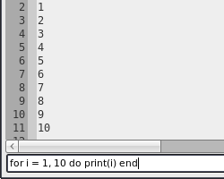

# Advanced

## Command Entry

Access to the Lua state is available through the command entry. Press `Ctrl+E`
(`⌘E` on Mac OSX | `M-C` in curses) to access it. It is useful for debugging,
inspecting, and entering `buffer` or `view` commands. If you try to cause
instability in Textadept's Lua state, you might very well succeed so be careful.
For available commands, see the [Lua API][]. Abbreviated commands for
[`buffer`][], [`view`][] and [`gui`][] are available: the command
`buffer:append_text('foo')` can be shortened to `append_text('foo')`. Therefore,
use `_G.print()` for Lua's `print()` since [`gui.print()`][] is shortened to
`print()`. You can also run commands on startup using the `-e` and `--execute`
command line switches.

[Lua API]: api/index.html
[`buffer`]: api/buffer.html
[`view`]: api/view.html
[`gui`]: api/gui.html
[`gui.print()`]: api/gui.html#print

### Tab Completion

Tab-completion for functions, variables, tables, etc. is available. Press the
`Tab` (`⇥` on Mac OSX | `Tab` in curses) key to display a list of available
completions. Use the arrow keys to make a selection and press `Enter` (`↩` |
`Enter`) to insert it.

### Extending

You can extend the command entry to do more than enter Lua commands. An
example of this is [incremental search][]. See *modules/textadept/find.lua* for
the implementation.

[incremental search]: api/gui.find.html#find_incremental

## Command Selection

If you did not disable the menu in your [preferences][], then pressing
`Ctrl+Shift+E` (`⌘⇧E` on Mac OSX | `M-S-C` in curses) brings up the command
selection dialog. Typing part of any command filters the list, with spaces being
wildcards. This is an easy way to run commands without navigating the menus,
using the mouse, or remembering key bindings. It is also useful for looking up
particular key bindings quickly. Note: the key bindings in the dialog do not
look like those in the menu. This different notation is how bindings are
represented internally. You can learn more about this in the [keys LuaDoc].

[preferences]: 08_Preferences.html#User.Init
[keys LuaDoc]: api/keys.html

## Shell Commands and Filtering Text

Sometimes it is easier to use an existing shell command to manipulate text
instead of using the command entry. An example would be sorting all text in a
buffer (or a selection). You could do the following from the command entry:

    ls={}; for l in buffer:get_text():gmatch('[^\n]+') do ls[#ls+1]=l end;
    table.sort(ls); buffer:set_text(table.concat(ls, '\n'))

A simpler way would be to press `Ctrl+|` (`⌘|` on Mac OSX | `^\` in curses),
enter the shell command `sort`, and hit `Enter` (`↩` | `Enter`).

The standard input (stdin) for shell commands is determined as follows:

* If text is selected and spans multiple lines, all text on the lines containing
  the selection is used. However, if the end of the selection is at the
  beginning of a line, only the EOL (end of line) characters from the previous
  line are included as input. The rest of the line is excluded.
* If text is selected and spans a single line, only the selected text is used.
* If no text is selected, the entire buffer is used.

The input text is replaced with the standard output (stdout) of the command.

## Remote Control

Since Textadept can execute arbitrary Lua code passed via the `-e` and
`--execute` command line switches, a side-effect of [single instance][]
functionality on the platforms that support it is that you can remotely control
the original instance. For example:

    ta ~/.textadept/init.lua &
    ta -e "events.emit(events.FIND, 'require')"

[single instance]: 02_Installation.html#Single.Instance
