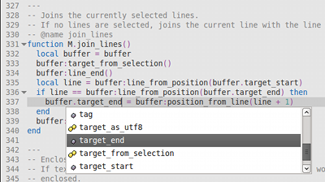

# Scripting

Since Textadept is entirely scriptable with Lua, the editor has superb support
for editing Lua code. Textadept provides syntax autocompletion and documentation
for the Lua and Textadept APIs. The [`lua` module][] also has more tools for
working with Lua code.

&nbsp;&nbsp;&nbsp;&nbsp;

[`lua` module]: api/_M.lua.html

## LuaDoc and Examples

Textadept's API is heavily documented. The [API documentation][] is the ultimate
resource on scripting Textadept. There are of course abundant scripting examples
since the editor's internals consist primarily of Lua.

[API documentation]: api/index.html

### Generating LuaDoc

Generate Textadept-like API documentation for your own modules using the
*doc/markdowndoc.lua* [LuaDoc][] module (you must have [Discount][] installed):

    luadoc -d . [-t template_dir] --doclet _HOME/doc/markdowndoc [module(s)]

where `_HOME` is the path where you installed Textadept and `template_dir` is an
optional template directory that contains two Markdown files: *.header.md* and
*.footer.md*. (See *doc/.header.md* and *doc/.footer.md* for examples.) LuaDoc
creates an *api/* directory in the current directory that contains the generated
API documentation HTML files.

[LuaDoc]: http://keplerproject.github.com/luadoc/
[Discount]: http://www.pell.portland.or.us/~orc/Code/discount/

## Lua Configuration

Textadept contains its own copy of [Lua 5.2][] which has the same configuration
(*luaconf.h*) as vanilla Lua with the following exceptions:

* `TA_LUA_PATH` and `TA_LUA_CPATH` replace the `LUA_PATH` and `LUA_CPATH`
  environment variables.
* `LUA_ROOT` is "/usr/" in Linux systems instead of "/usr/local/".
* `LUA_PATH` and `LUA_CPATH` do not have "./?.lua" and "./?.so" in them.
* No Lua 5.1 compatibility flags are set.

[Lua 5.2]: http://www.lua.org/manual/5.2/

### LuaJIT

Even though Textadept runs with [LuaJIT][], LuaJIT does not fully support
Lua 5.2. Therefore, try to write your modules and scripts to be compatible with
both versions. For the most part, LuaJIT only lacks Lua 5.2's new `_ENV`.

[LuaJIT]: http://luajit.org

## Scintilla

Textadept uses the [Scintilla][] editing component. The [buffer][] part of
Textadept's API emulates the [Scintilla API][] so porting any C/C++ Scintilla
calls to Lua should not be difficult.

[Scintilla]: http://scintilla.org
[buffer]: api/buffer.html
[Scintilla API]: http://scintilla.org/ScintillaDoc.html

## Textadept Structure

Because Textadept consists mainly of Lua, its Lua scripts have to be stored in
an organized folder structure.

### Core

The *core/* directory contains Textadept's core Lua modules. These modules are
essential for the application to run. They provide Textadept's Lua to C
interface, event structure, file interactions, and localization.

### Lexers

Lexer modules analyze source code for syntax highlighting. *lexers/* houses
them.

### Modules

*modules/* contains generic and language modules for editing text and source
code.

### Themes

*themes/* has built-in themes that customize the look and feel of Textadept.

### User

The *~/.textadept/* folder houses your preferences, Lua modules, themes, and
user-data. This folder may contain *lexers/*, *modules/*, and *themes/*
sub-directories.

### GTK+

GTK+ uses the *etc/*, *lib/*, and *share/* directories, which only appear in the
Win32 and Mac OSX packages.
