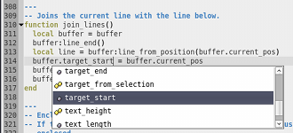
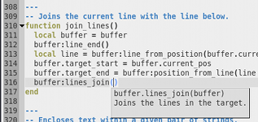

# Scripting

Textadept has superb support for editing Lua code. Syntax autocomplete and
LuaDoc is available for many Textadept objects as well as Lua's standard
libraries. See the [lua module documentation](../modules/_m.lua.commands.html)
for more information.

&nbsp;&nbsp;&nbsp;&nbsp;

## LuaDoc and Examples

Textadept's API is heavily documented. The [LuaDoc](../index.html) is the
ultimate resource on scripting Textadept. There are of course abundant scripting
examples since Textadept is mostly written in Lua.

## Lua Configuration

[Lua 5.2](http://www.lua.org/manual/5.2/) is built into Textadept. It has the
same configuration (`luaconf.h`) as vanilla Lua with the following exceptions:

* `TA_LUA_PATH` and `TA_LUA_CPATH` are the environment variable used in place of
  the usual `LUA_PATH` and `LUA_CPATH`.
* `LUA_ROOT` is `/usr/` in Linux systems instead of `/usr/local/`.
* All compatibility flags for Lua 5.1 are turned off. (`LUA_COMPAT_UNPACK`,
  `LUA_COMPAT_LOADERS`, `LUA_COMPAT_LOG10`, `LUA_COMPAT_LOADSTRING`,
  `LUA_COMPAT_MAXN`, and `LUA_COMPAT_MODULE`.)

## Scintilla

The editing component used by Textadept is [Scintilla](http://scintilla.org).
The [buffer](../modules/buffer.html) part of Textadept's API is derived from the
[Scintilla API](http://scintilla.org/ScintillaDoc.html) so any C/C++ code using
Scintilla calls can be ported to Lua without too much trouble.

## Textadept Folder Structure

Because Textadept is mostly written in Lua, its Lua scripts have to be stored in
an organized folder structure.

#### Core

Textadept's core Lua modules are contained in `core/`. These are absolutely
necessary in order for the application to run. They are responsible for
Textadept's Lua to C interface, event structure, file input/output, and
localization.

#### Lexers

Lexer Lua modules are responsible for the syntax highlighting of source code.
They are located in `lexers/`.

#### Modules

Editor Lua modules are contained in `modules/`. These provide advanced text
editing capabilities and can be available for all programming languages or
targeted at specific ones.

#### Themes

Built-in themes to customize the look and behavior of Textadept are located in
`themes/`.

#### User

User Lua modules are contained in the `~/.textadept/` folder. This folder may
contain `lexers/`, `modules/`, and `themes/` subdirectories.

#### GTK

The `etc/`, `lib/`, and `share/` directories are used by GTK and only appear in
the Win32 and Mac OSX packages.
