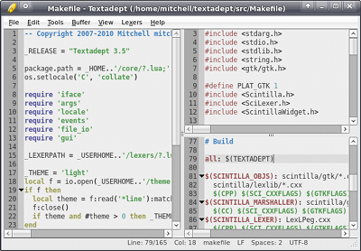

# Introduction

## Overview

  

Textadept is a cross-platform text editor for programmers.

In a world where code bloat is commonplace and application speed is second to
its number of features, Textadept breaks that trend, aiming to stay minimalist
and fast, but at the same time being ridiculously extensible. At its core lies
less than 2000 lines of C code, and that is how it always will be. While other
editors rely on numerous plugins for a wide range of functionality, recordable
macros to speed up workflow, and shell scripts to quickly transform text,
Textadept takes it to the extreme: it gives you complete control over the entire
application using the embedded [Lua](http://lua.org) language. Lua is one of the
fastest scripting languages available and has a very small footprint. In fact,
most of Textadept is written in Lua. The application's incredibly fast startup
time and operation attest to Lua's worthiness.

Tired of all those features you never use in other editors? With Textadept you
can disable or remove anything you dislike or do not need. Wish you had an
additional feature? Chances are you can add it yourself.

Annoyed of recording complicated macros in other editors, only to find yourself
re-recording them over and over with little changes each time? You may be
surprised to find you can write the same commands in Lua, from moving the caret
to replacing text, performing searches, and much more!

Worried that your existing shell scripts for transforming text in other editors
will not be compatible with Lua or Textadept? No need to be. You can run those
scripts from within the editor or Lua.

These are just some of Textadept's strengths. Textadept is not about
constraining the user to a certain set of features while allowing minimal
customization and/or extensibility. Textadept is about allowing that
customization and extensibility from the start; the features come after that.

  

## Manual Notation

* `~/` is denoted as the user's home directory. On Windows machines this is the
  value of the `USERHOME` environment variable (typically `C:\Users\<username>\`
  or `C:\Documents and Settings\<username>\`). On Linux and Mac OSX machines it
  is the value of `HOME` (typically `/home/<username>/` and `/Users/<username>/`
  respectively).
* Any relative directory paths, i.e. paths that do not begin with `/` or `C:\`,
  are relative to the location of Textadept.
* Key combinations are not case-sensitive. `Ctrl+N` means the `N` key is pressed
  with only the `Control` key being held down, not the `Shift` key.
  `Ctrl+Shift+N` means the `N` key is pressed with both `Control` and `Shift`
  keys being held down. The same notation is applicable to key chains:
  `Ctrl+N, N` vs. `Ctrl+N, Shift+N`. In the first key chain, `Control` and `N`
  are pressed followed by `N` with no modifiers. The second has `Control` and
  `N` pressed followed by `Shift` and `N`.

## Features at a Glance

* Self-contained executable - no installation necessary.
* Entirely keyboard driven.
* Unlimited split views.
* Support for over 80 programming languages.
* Powerful snippets and key commands.
* Code autocompletion and API lookup.
* Unparalleled extensibility.
