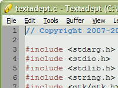

# Installation

## Requirements

In its bid for minimalism, Textadept also needs very little to run. In fact, the
only thing it needs is [GTK+ 2.0](http://gtk.org) >= 2.16 on Linux systems. GTK
is already included in Windows and Mac OSX packages. Textadept also has it's own
version of Lua.

Note: for Win32 and Mac OSX, more than 3/4 of the download and unpackaged
application sizes are due to GTK, the cross-platform GUI toolkit Textadept uses.
Textadept itself is much smaller.

#### Linux

Most Linux systems already have GTK+ installed. If not, it is probably available
through your package manager. Otherwise, compile and install it from the
[GTK+ website](http://www.gtk.org/download-linux.html).

#### Mac OSX

Prior to 3.5, the GTK+ [Mac OSX Framework][GTK-OSX] was required. Newer versions
are all-inclusive and do not require anything.

[GTK-OSX]: http://code.google.com/p/textadept/downloads/detail?name=Gtk-Framework-2.14.3-2-test1.dmg

Note that Textadept is designed for Intel Leopard+ Macs.

#### Windows

Prior to 3.5, the [GTK+ 2.0 Runtime](http://sourceforge.net/projects/gtk-win/)
was required. Newer versions are all-inclusive and do not require anything.

## Download

Download Textadept from the [project page](http://textadept.googlecode.com/).
Select the appropriate package for your platform.

## Installation

Textadept was designed to be as easy as possible to install by any user. You do
not need to have administrator privileges.

#### Linux

Unpack the archive anywhere. Run Textadept by running
`/path/to/textadept_VERSION/textadept` from the terminal. You can also create a
symlink to the executable in your `PATH` (e.g. `/usr/bin`) or make a GNOME, KDE,
XFCE, etc. button or menu launcher.

##### Problems

It is difficult to provide a single binary that runs on all Linux platforms
since the versions of software installed vary widely from distribution to
distribution. Because the Linux version of Textadept uses the version of GTK
installed on your system, an error like: `error while loading shared  libraries:
<lib>: cannot open shared object file: No such file or directory` may occur when
trying to run the program.

The most common occurance of this error is for the `libpng12` library on 64-bit
(x86\_64) Debian and Debian-based Linux distributions like Ubuntu because
`libpng12` has not been replaced in favor of the newer `libpng14`. If you are
experiencing this error, simply rename `textadept.lpng12` to `textadept`. The
former has been compiled to use `libpng12`.

If the above situation did not apply to you, do not be alarmed. The solution is
actually quite painless even though it requires recompiling Textadept. See the
[compiling](12_Compiling.html) page for more information.

#### Mac OSX

Unpack the archive and move `textadept.app` to your user or system
`Applications` directory like any other Mac OSX application. Run Textadept by
double-clicking `textadept.app`.

#### Windows

Unpack the archive anywhere. Run Textadept by double-clicking `textadept.exe`.
You can also create shortcuts to the executable in your Start Menu, Quick Launch
toolbar, Desktop, etc.

&nbsp;&nbsp;

&nbsp;&nbsp;

