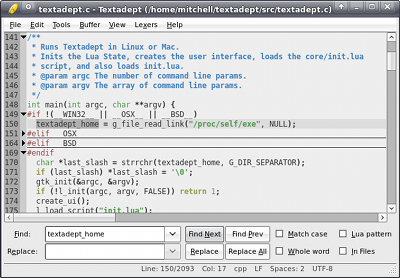

# User Interface

  

Textadept's user interface was designed to be simple. It consists of an optional
menubar, editor view, initially hidden find/replace dialog, initially hidden
command entry, and statusbar. Below are brief descriptions of these features.
More in-depth discussion about some of them is provided later in the manual.

## Menubar

The completely customizable (and optional!) menubar provides access to all of
Textadept's features.

## Editor View

The editor view is where you will spend most of your time in Textadept. It
supports unlimited split views and is completely controllable by Lua.

## Find and Replace Dialog

This compact dialog is a great way to slice and dice through your document or
directory of files. You can even find and replace text using Lua patterns. It is
available when you need it and quickly gets out of your way when you do not,
minimizing distractions.

## Command Entry

The versatile command entry functions as both a place to execute Lua commands
with the internal Lua state and find text incrementally. You can extend it to do
even more if you would like. Like the find/replace dialog, the command entry
pops in and out as you wish.

## Statusbar

The left side of the statusbar displays any status messages. The right side
shows the current buffer's status.

   
