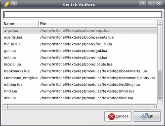
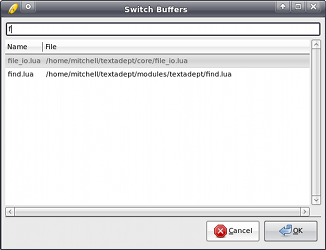

# Working with Files

## Lack of Tabs

One of the first things you will notice when opening multiple files in Textadept
is that there is no tab bar showing the files that are open. This was a design
decision. Textadept was built to support unlimited split views, so having a tab
bar with all open buffers would clutter the interface greatly. There is also the
question of where to place the bar (above, below, or to one side) and how many
to have (one for each split view or a single one under the menubar).

You can see which buffer is active by looking at Textadept's titlebar. Pressing
`Ctrl+Tab` (`^⇥` on Mac OSX) cycles to the next buffer and `Ctrl+Shift+Tab`
(`^⇧⇥`) cycles to the previous one.

## Buffer Browser

To move quickly between buffers, press `Ctrl+B` (`⌘B` on Mac OSX) to open the
buffer browser.

The buffer browser shows you a list of currently open buffers, the most recent
towards the bottom. Typing part of any filename filters the list. Spaces are
wildcards. You can also just use the arrow keys. Pressing `Enter` or clicking
`OK` switches to the selected buffer.

## Split Views

Textadept allows you to split the editor window as many times as you like either
horizontally or vertically. `Ctrl+Alt+S` or `Ctrl+Alt+H` splits horizontally
(top-bottom) and `Ctrl+Alt+V` splits vertically (`^S` and `^V` respectively on
Mac OSX). You can resize the splitter bar by clicking and dragging with the
mouse or using `Ctrl+Alt++` and `Ctrl+Alt+-` (`^+` and `^-`). The same file can
be worked with in multiple split views.

Pressing `Ctrl+Alt+N` (`^⌥⇥` on Mac OSX) goes to the next view and `Ctrl+Alt+P`
(`^⌥⇧⇥`) goes to the previous one.

To unsplit a view, enter the view to keep open and press `Ctrl+Alt+W` (`^W` on
Mac OSX). To unsplit all views, use `Ctrl+Alt+Shift+W` (`^⇧W`).

## Sessions

By default, Textadept saves the list of open buffers on exit so it can reload
them the next time it starts up. You can disable this by passing the `-n` or
`--no-session` switch to Textadept on startup. Sessions can be manually saved
and opened via the `File -> Save Session...` and `File -> Load Session...`
menus.

Sessions save additional information such as current split views, caret and
scroll positions in each buffer, Textadept's window size, and recently opened
files.

## Snapopen

A quicker, though slightly more limited alternative to the standard
`File -> Open` dialog is snapopen. It behaves like the buffer browser, but
displays a list of files to open, including files in subdirectories. You can
snapopen the current file's directory with `Ctrl+Alt+Shift+O` (`^⌘⇧O` on Mac
OSX) or from the `Tools -> Snapopen -> Current Directory` menu. Snapopen is
pretty limited from the menu, but more versatile in scripts. See its
[LuaDoc](../modules/_m.textadept.snapopen.html). `Ctrl+U` (`⌘U`) snaps open
`~/.textadept/`.

