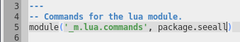

# File Navigation

## Bookmarks

You can place bookmarks on lines in buffers to jump back to them later. Use the
`Tools -> Bookmark` menu options or key commands to do so.

## Goto Line

To jump to a specific line in a file, press `Ctrl+J` (`⌘J` on Mac OSX) and
specify the line number in the prompt and press `Enter` (`↩`) or click `OK`.

## Goto Matching Brace

By default, Textadept will highlight the matching brace characters under the
caret : `(`, `)`, `[`, `]`, `{`, `}`, `<`, and `>`. Pressing `Ctrl+M` (`^M` on
Mac OSX) moves the caret to that matching brace and `Ctrl+Shift+M` (`^⇧M`)
extends the selection.

## Mac OSX

Textadept supports the keybindings you are accustomed to for navigating text
fields in Mac OSX.

              
