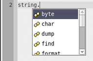
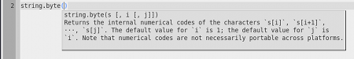
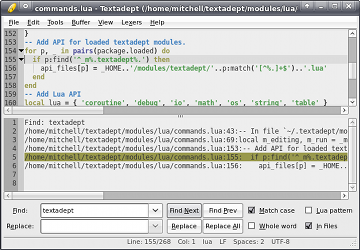
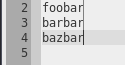

# Adept Editing

## Key Commands

Textadept is entirely keyboard-driven. See the comprehensive list of key
commands in the [appendix](14_Appendix.html#key_bindings). Key commands can be
modified in your [preferences](9_Preferences.html#key_commands).

## Character Autopairing

Usually, quote (`'`, `"`) and brace (`(`, `[`, `{`) characters go together in
pairs. By default, Textadept automatically inserts the complement character when
the first is typed. Similarly, the complement is deleted when you press
`Backspace` over the first. See the
[preferences](9_Preferences.html#module_settings) page if you would like to
disable this.

## Word Completion

Textadept provides buffer-based word completion. Start typing a word, press
`Ctrl+Return` (`Esc` on Mac OSX), and a list of suggested completions based on
words in the current document is provided. Continuing to type changes the
suggestion. Press `Return` to complete the selected word.

## Adeptsense

Textadept has the capability to autocomplete symbols for programming languages
and display API documentation. Lua is of course supported extremely well and
C/C++ has basic support with the help of [ctags](http://ctags.sf.net). Symbol
completion is available by pressing `Ctrl+I` (`~` on Mac OSX).

&nbsp;&nbsp;&nbsp;&nbsp;

For more information on adding adeptsense support for another language, see
the [LuaDoc](../modules/_m.textadept.adeptsense.html).

## Find and Replace

`Ctrl+F` (`Apple+F` on Mac OSX) brings up the Find/Replace dialog. In addition
to offering the usual find and replace, Textadept allows you to find with [Lua
patterns](14_Appendix.html#lua_patterns) and replace with Lua captures and even
Lua code! For example: replacing all `(%w+)` with `%(string.upper('%1'))`
capitalizes all words in the buffer. Lua captures (`%n`) are only available from
a Lua pattern search, but embedded Lua code enclosed in `%()` is always allowed.

#### Find in Files

Find in Files (`Apple+Shift+F` on Mac OSX) will prompt for a directory to
search. The results are displayed in a new buffer. Double-clicking a search
result jumps to it in the file. Replace in Files is not supported. You will have
to `Find in Files` first, and then `Replace All` for each file a result is found
in. The `Match Case`, `Whole Word`, and `Lua pattern` flags still apply.

#### Find Incremental

You can start an incremental search by pressing `Ctrl+Shift+F` (`Apple+I` on Mac
OSX). Incremental search searches the buffer as you type. Only the `Match Case`
option is recognized.

#### Replace in Selection

By default, `Replace All` replaces all text in the buffer. If you want to
replace all text in just a portion of the buffer, select a block of text and
then `Replace All`.

## Indentation

#### Increase or Decrease Indent Level

The amount of indentation for a selected set of lines is increased by pressing
`Tab` and decreased by pressing `Shift+Tab`. Using these key sequences when no
selection is present does not have the same effect.

#### Change Indent Size

The indent size is usually set by a [language-specific
module](7_Modules.html#buffer_properties) or the [theme](8_Themes.html#buffer).
Textadept shows what it is using for indentation in the document statusbar.

#### Using Tabs Instead of Spaces

You can use tabs instead of the default spaces by pressing `Ctrl+T, V, Tab`
(Apple+T, V, Tab on Mac OSX) or using the `Buffer -> Toggle Use Tabs` menu.
Textadept shows what it is using for indentation in the document statusbar.

The default option is usually set by a [language-specific
module](7_Modules.html#buffer_properties) or the [theme](8_Themes.html#buffer).

#### Converting Between Tabs and Spaces

Use the `Edit -> Convert Indentation` menu to convert indentation. If the buffer
is using tabs, all spaces are converted to tabs. If the buffer is using spaces,
all tabs are converted to spaces.

## Selecting Text

#### Rectangular Selection

Holding `Alt+Shift` (`Apple+Shift` on Mac OSX) and pressing the arrow keys
enables rectangular selections to be made. Start typing to type on each line.

&nbsp;&nbsp;&nbsp;&nbsp;

#### Multiple Selection

Clicking the mouse at a point in the buffer while holding `Control` places an
additional caret at that point. Clicking and dragging while holding `Control`
creates multiple selections. Start typing to enter text at each selection.

#### Selecting Entities

Textadept allows you to select many different entities from the caret. `Alt+S`
(`Ctrl+S` on Mac OSX) is the key prefix to entity selection. Typing `'`, `"`,
`(`, `[`, or `{` selects all text between the matching delimiters. Typing `W`,
`L`, `P`, `B`, or `S` (without holding `Shift`) selects the current word, line,
paragraph, indented block, or style respectively. Typing `T` selects the text
between `>` and `<`, useful for selecting within HTML tags. Typing `G` grows the
current selection by one character to each side, so `Alt+S, "` followed by
`Alt+S, G` selects an entire `""` sequence instead of just the text in-between
quotes. Finally, typing `C` followed by any other character selects all text
between a pair of those characters. `Alt+S, C, "` is identical to `Alt+S, "`.

## Enclosing Text

As a complement to selecting entities, you can enclose text as entities. The
key prefix is `Alt+C` (`Ctrl+C` on Mac OSX). Typing `'`, `"`, `(`, `[`, or `{`
encloses the text in the appropriate character pair. Typing `T` (without holding
`Shift`) creates an opening and closing HTML tag while `Shift+T` creates a
single HTML tag. Finally, typing `C` followed by any other character encloses
the text between a pair of those characters. `Alt+C, C, "` is identical to
`Alt+C, "`.

If no text is selected, the word to the left of the caret is enclosed.

## Word Highlight

All occurrences of a given word are highlighted by putting the caret over the
word and pressing `Ctrl+H` (`Ctrl+Apple+T` on Mac OSX). This is useful to show
occurrences of a variable name in source code.

## Editing Modes

#### Virtual Space

Virtual space (freehand) mode is enabled and disabled with `Ctrl+T, V, V`
(`Apple+T, V, V` in Mac OSX). When enabled, caret movement is not restricted by
line endings.

#### Overwrite

Overwrite mode is enabled and disabled with the `Insert` key. When enabled,
characters in the buffer will be overwritten instead of inserted as you type.
The caret also changes to an underline when in overwrite mode.
