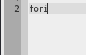

# Modules

Most of Textadept's functionality comes from modules written in Lua. A module
consists of a single directory with an `init.lua` script to load any additional
Lua files (typically in the same location). Essentially there are two classes of
module: generic and language-specific.

## Generic

This class of modules is usually available globally for programming in all
languages or writing plain-text. An example is the
[textadept](../modules/_m.textadept.html) module which implements most of
Textadept's functionality (find/replace, key commands, menus, snippets, etc.).
These kinds of modules are generally loaded on startup. See the
[preferences](9_Preferences.html#user_init) page for instructions on how to load
generic modules when Textadept starts.

## Language Specific

Each module of this class of modules is named after a language lexer in the
`lexers/` directory and is only available only for editing code in that
particular programming language unless you specify otherwise. Examples are the
[cpp](../modules/_m.cpp.html) and [lua](../modules/_m.lua.html) modules which
provide special editing features for the C/C++ and Lua languages respectively.

#### Lexer

All languages have a [lexer](../modules/lexer.html) that performs syntax
highlighting on the source code. While the lexer itself is not part of the
module, its existence in `lexers/` is required.

#### Activation

Language-specific modules are automatically loaded when a file of that language
is loaded or a buffer's lexer is set to that language.

#### Snippets

Most language-specific modules have a set of
[snippets](../modules/_m.textadept.snippets.html). Press `Ctrl+Alt+Shift+I`
(`Ctrl+Apple+Shift+I` on Mac OSX) for a list of available snippets or see the
module's Lua code. To insert a snippet, type its trigger followed by the `Tab`
key. Subsequent presses of `Tab` causes the caret to enter tab stops in
sequential order, `Shift+Tab` goes back to the previous tab stop, and
`Ctrl+Alt+I` (`Ctrl+Apple+I` on Mac OSX) cancels the current snippet. Snippets
can be nested (inserted from within another snippet).

&nbsp;&nbsp;&nbsp;&nbsp;

#### Commands

Most language-specific modules have a set of [key
commands](../modules/_m.textadept.keys.html). See the module's Lua code for
which key commands are available.

##### Run

Most language-specific modules have a command that runs the code in the current
file. Pressing `Ctrl+R` runs that command.

##### Compile

Most language-specific modules have a command that compiles the code in the
current file. Pressing `Ctrl+Shift+R` runs that command.

##### Block Comments

Pressing `Ctrl+Q` comments or uncomments the code on the selected lines.

#### Buffer Properties

Sometimes language-specific modules set default buffer properties like tabs and
indentation size. See the module's Lua code for these settings. If you wish to
change them or use different settings, see the
[Customizing Modules](#customizing_modules) section below.

## Getting Modules

The officially supported language modules are hosted on
[Bitbucket](https://bitbucket.org/mitchell) and are available as a separate
download. To upgrade to the most recent version of a module, you can either use
[Mercurial](http://mercurial.selenic.com) (run `hg pull` and then `hg update` on
or from within the module) or download a zipped version from the module's
repository homepage and overwrite the existing one. If you do not have access to
`_HOME`, place the updated module in your `_USERHOME` and replace all instances
of `_HOME` with `_USERHOME` in the module's `init.lua`.

For now, user-created modules are obtained from the
[wiki](http://caladbolg.net/textadeptwiki).

## Installing Modules

It is recommended to put all custom or user-created modules in your
`~/.textadept/modules/` directory so they will not be overwritten when you
update Textadept. Also, modules in that directory override any modules in
Textadept's  `modules/` directory. This means that if you have your own `lua`
module, it will be loaded instead of the one that comes with Textadept.

## Developing Modules

See the [LuaDoc](../modules/_m.html) for modules.

## Customizing Modules

It is never recommended to modify the default modules that come with Textadept,
even if you just want to change the buffer settings for a language-specific
module or add a few more snippets. Instead you have two options: load your own
module instead of the default one or load your custom module code after the
default module loads. To load your own module, simply place it appropriately in
`~/.textadept/modules/`. To load your module code after the default module
loads, create a `post_init.lua` Lua script in the appropriate
`~/.textadept/modules/` sub-folder. Please note that for generic modules, only
the first option applies. Either option applies for language-specific modules.

Suppose you wanted to completely change the menubar structure. You would first
create a new `menu.lua` and then put it in `~/.textadept/modules/textadept/`.
Now when Textadept looks for `menu.lua`, it will load yours instead of its own.
Similarly, if you copy the default Lua language-specific module (`modules/lua`)
to `~/.textadept/modules/` and make custom changes, that module is loaded for
editing Lua code instead of the default module.

If you keep a modified copy of language-specific modules, you will likely want
to update them with each new Textadept release. Instead of potentially wasting
time merging your changes, you can load custom code independent of the module in
a `post_init.lua` file. For example, instead of copying the `lua` module and
changing its `set_buffer_properties()` function to use tabs, you can do this
from `post_init.lua`:

    module('_m.lua', package.seeall)

    function set_buffer_properties()
      buffer.use_tabs = true
    end

Similarly, you can use `post_init.lua` to change the compile/run commands, load
more [Adeptsense tags](../modules/_m.textadept.adeptsense.html#load_ctags), and
add additional key commands and snippets.
