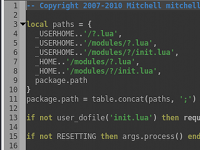
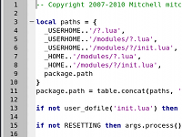

# Themes

Textadept's look and feel can be customized with themes. The themes that come
with Textadept are `'light'`, `'dark'`, and `'scite'`. By default the `'light'`
theme is used. The `'scite'` theme is recommended for users accustomed to SciTE.
To change the theme, create a `~/.textadept/theme` file whose first line of text
is the name of the theme you would like to use.

&nbsp;&nbsp;&nbsp;&nbsp;

&nbsp;&nbsp;&nbsp;&nbsp;

Themes apply to all buffers. You cannot assign a theme to a particular file or
filetype. You can change things like tab and indent settings per filetype
however by creating a [language-specific
module](7_Modules.html#buffer_properties).

## Creating or Modifying a Theme

Each theme is a single folder on the filesystem composed of three files:
`lexer.lua`, `buffer.lua`, and `view.lua`. It is recommended to put themes in
your `~/.textadept/themes/` directory so they will not be overwritten when you
update Textadept. Themes in that directory override any themes in Textadept's
`themes/` directory. This means that if you have your own `light` theme, it will
be loaded instead of the one that comes with Textadept.

To use a theme not located in `~/.textadept/themes/` or Textadept's `themes/`
directory, you need to specify an absolute path to the theme's folder in your
`~/.textadept/theme` file.

#### Lexer

Textadept uses lexers to assign names to buffer elements like comments, strings,
and keywords. These elements are assigned styles composed of font and color
information in the theme's `lexer.lua`. See the `Styling Tokens` section of the
[lexer](../modules/lexer.html) page for more information on how to create styles
and colors.

#### Buffer

`buffer.lua` contains buffer-specific properties like indentation size and
whether or not to use tabs. See the [LuaDoc](../modules/buffer.html) for
documentation on the properties.

#### View

`view.lua` contains view-specific properties like caret and selection colors.
See the [LuaDoc](../modules/buffer.html) for documentation on the properties.

## Theming Text Fields

There is no way to theme text fields like the Find and Replace ones from within
Textadept. Instead, use [GTK Resource files][gtkrc]. The names of the text field
widgets are:

* Find field: `textadept-find-entry`.
* Replace field: `textadept-replace-entry`.
* Command entry: `textadept-command-entry`.

[gtkrc]: http://library.gnome.org/devel/gtk/stable/gtk-Resource-Files.html
