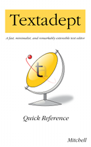

## Textadept Quick Reference Book

  

*Textadept Quick Reference* 
Fourth Edition

Order the <a href="https://gum.co/textadept_ebook" target="_blank">e-book</a> --
$15 USD[†](#note) 
Order the <a href="https://gum.co/qr_bundle" target="_blank">e-book bundle</a>
with [Lua Quick Reference][] -- $27 USD 
Order the print book via Amazon [US][], [CA][], [UK][], [DE][], [FR][], [IT][],
[ES][] -- ~$25 USD

Published: Aug 2018 
ISBN: 978-0-9912379-4-4 
Pages: 174

[Excerpt][]

Textadept is a fast, minimalist, and remarkably extensible cross-platform text
editor for programmers. This quick reference contains a wealth of knowledge on
how to script and configure Textadept using the Lua programming language. It
groups the editor's rich API into a series of tasks in a convenient and
easy-to-use manner.

This book covers how to:

* Leverage Textadept's important files and folders
* Adeptly navigate and manipulate text
* Mark lines and text visually
* Show interactive lists and call tips
* Prompt for user input in various ways
* Spawn asynchronous, interactive child processes
* Configure colors, themes, and other settings
* Define lexers for highlighting source code
* And much more

It serves as the perfect complement to Textadept's comprehensive Manual and
exhaustive API documentation.

† Your purchase of the Fourth Edition e-book (either by itself or as
part of a bundle) entitles you to a free copy of the forthcoming Fifth Edition
e-book when it is released.

[Lua Quick Reference]: https://orbitalquark.github.io/lua-quick-reference
[US]: https://www.amazon.com/Textadept-Quick-Reference-Mitchell/dp/0991237943/
[CA]: https://www.amazon.ca/Textadept-Quick-Reference-Mitchell/dp/0991237943/
[UK]: https://www.amazon.co.uk/Textadept-Quick-Reference-Mitchell/dp/0991237943/
[DE]: https://www.amazon.de/Textadept-Quick-Reference-Mitchell/dp/0991237943/
[FR]: https://www.amazon.fr/Textadept-Quick-Reference-Mitchell/dp/0991237943/
[IT]: https://www.amazon.it/Textadept-Quick-Reference-Mitchell/dp/0991237943/
[ES]: https://www.amazon.es/Textadept-Quick-Reference-Mitchell/dp/0991237943/
[Excerpt]: https://github.com/orbitalquark/textadept/blob/default/docs/quickref_excerpt.pdf
